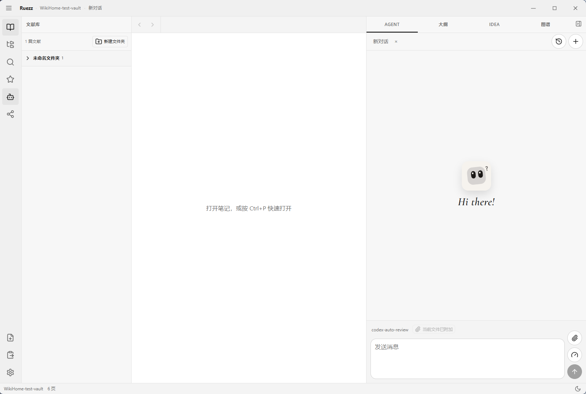

<p align="center">
  
</p>

<h1 align="center">Ruezz</h1>

<p align="center">
  <b>Local-first AI literature vault for researchers</b> — manage PDFs like Zotero, grow knowledge like a wiki, pin Ideas as you read.<br/>
  <i>瑞知：给科研人的本地 AI 文献库（目前提供 Windows 安装包）。</i>
</p>

<p align="center">
  <a href="https://github.com/wannong/ruezz/releases/latest"></a>
  <a href="README.md">中文</a>
  ·
  <a href="CHANGELOG.md">Changelog</a>
  ·
  <a href="LICENSE">MIT</a>
</p>

<p align="center">
  <a href="https://github.com/wannong/ruezz/releases/latest"><b>⬇ Download Windows installer</b></a>
</p>

<p align="center">
  
</p>

The installer bundles Node / Python / MarkItDown — **no** toolchain setup. Bring your own OpenAI-compatible API (DeepSeek, ZhiPu, Kimi, OpenAI, …).

## How it differs

Ruezz builds on the [LLM Wiki](https://github.com/karpathy/llm-wiki) idea, productized for **research paper reading**: original-file library, PDF region Ideas, and a zero-setup desktop shell.

| | Ruezz | Zotero | Obsidian | [llm_wiki](https://github.com/nashsu/llm_wiki) & friends |
|---|---|---|---|---|
| Paper originals (Zotero-like) | ✅ | ✅ | plugins / DIY | wiki-text focused |
| LLM Wiki (raw → wiki, rebuildable index) | ✅ | ❌ | DIY | ✅ |
| **Idea stickies** on PDF regions (equations / figures) | ✅ | different annotations | plugins | uncommon |
| Zero-setup desktop installer | ✅ Windows | ✅ | ✅ | often source/CLI |
| Built-in Agent + tool loop | ✅ | limited | external | varies |

Import archives one literature page per file; concept “compile / 内化” is an explicit Agent step, not a side effect of import.

## Quick start

1. Open the [latest Release](https://github.com/wannong/ruezz/releases/latest) and download `Ruezz_*_x64-setup.exe`
2. Install (current-user; admin usually not required)
3. Pick a vault folder, add API base URL + key → enter workspace

Requires 64-bit Windows 10 / 11. In-app updates live under **Settings → About** (signed).

## Develop

- Node.js **22.19+**
- pnpm 9+
- Rust + Cargo (optional, for the Tauri shell)

```bash
pnpm install
pnpm build
pnpm smoke
pnpm dev:desktop
```

See [docs/ARCHITECTURE.md](docs/ARCHITECTURE.md).

## License

MIT. Third-party notices: [NOTICE](NOTICE).
