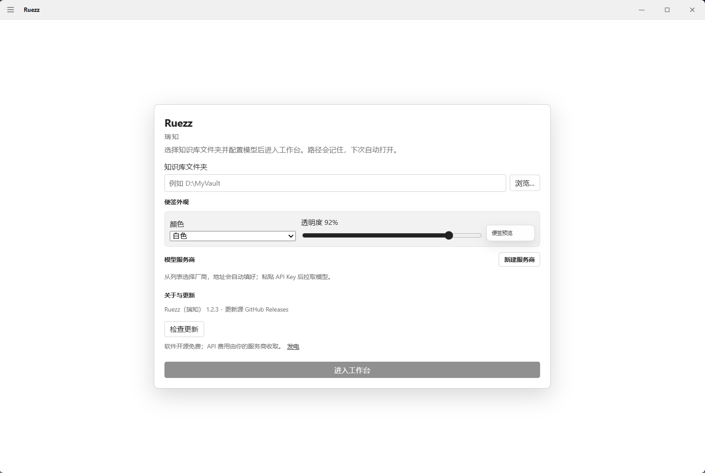
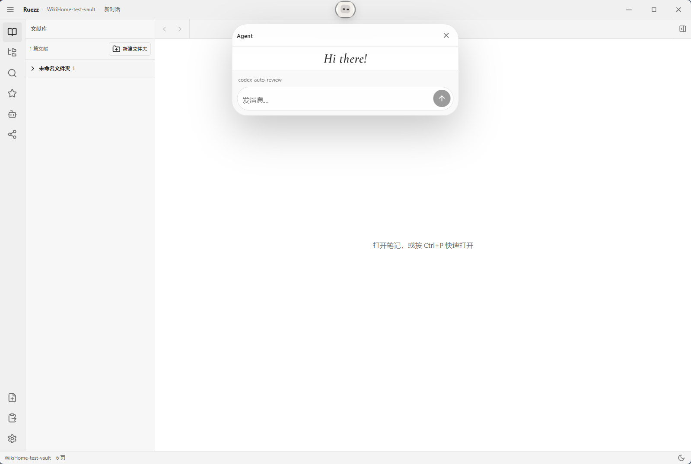

<p align="center">
  
</p>

<h1 align="center">Ruezz（瑞知）</h1>

<p align="center">
  <b>给科研人的本地 AI 文献库</b>：像 Zotero 一样管 PDF，像 Wiki 一样沉淀知识，随手钉 Idea。<br/>
  <i>Local-first research paper knowledge base with LLM Wiki &amp; sticky Ideas (Windows).</i>
</p>

<p align="center">
  <a href="https://github.com/wannong/ruezz/releases/latest"></a>
  <a href="README.en.md">English</a>
  ·
  <a href="CHANGELOG.md">Changelog</a>
  ·
  <a href="LICENSE">MIT</a>
</p>

<p align="center">
  <a href="https://github.com/wannong/ruezz/releases/latest"><b>⬇ 下载 Windows 安装包（Releases）</b></a>
</p>

<p align="center">
  
</p>

安装包内置 Node / Python / MarkItDown，**不用**再装开发工具。需要自备 OpenAI-compatible API（DeepSeek、智谱、Kimi、OpenAI 等均可）。

## 和同类工具差在哪

Ruezz 站在 [Karpathy 提出的 LLM Wiki](https://github.com/karpathy/llm-wiki) 思路上，但面向**科研文献阅读**做了产品化：原件管理、PDF 区域便签、本地桌面壳。

| | Ruezz | Zotero | Obsidian | [llm_wiki](https://github.com/nashsu/llm_wiki) 等 |
|---|---|---|---|---|
| 文献原件归档（类 Zotero） | ✅ | ✅ | 插件/自建 | 偏 wiki 文本 |
| LLM Wiki（raw → wiki，可重建索引） | ✅ | ❌ | 需自建工作流 | ✅ |
| PDF 上框选公式/图表贴 **Idea 便签** | ✅ | 标注不同 | 取决于插件 | 少见 |
| 本地桌面安装包（零环境） | ✅ Windows | ✅ | ✅ | 多为源码/CLI |
| 自带 Agent 对话 + 工具循环 | ✅ | 有限 | 需外挂 | 视实现 |

导入会整篇归档为文献页，**不会**在导入时自动拆概念；「内化」是你主动让 Agent 做的后续步骤。

## 三步开始

1. 打开 [最新 Release](https://github.com/wannong/ruezz/releases/latest)，下载 `Ruezz_*_x64-setup.exe`
2. 双击安装（默认当前用户，一般不需要管理员）
3. 选一个知识库文件夹，在设置里填入 API 地址与 Key → 进入工作台

<p align="center">
  
</p>

系统要求：64 位 Windows 10 / 11。装好后可在 **设置 → 关于与更新** 检查新版本（签名校验）。

更多界面：

<p align="center">
  
</p>

## 开发

- Node.js **22.19+**（与 vendored `pi-ai` 一致）
- pnpm 9+
- Rust + Cargo（可选，桌面壳）

```bash
pnpm install
pnpm build
pnpm smoke          # mock LLM 端到端
pnpm dev:desktop    # Tauri 桌面
```

架构：GUI（React）→ Tauri → Node sidecar；引擎经 `@wikihome/engine-api` 接入 vendored `llmwiki-core`。详见 [docs/ARCHITECTURE.md](docs/ARCHITECTURE.md)。

## 许可

MIT。第三方声明见 [NOTICE](NOTICE)。
